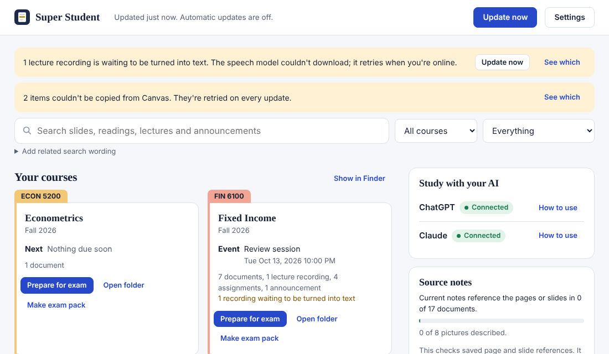
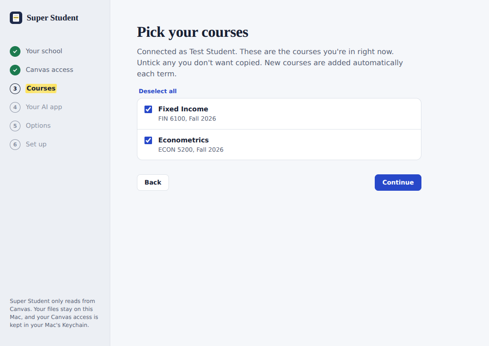
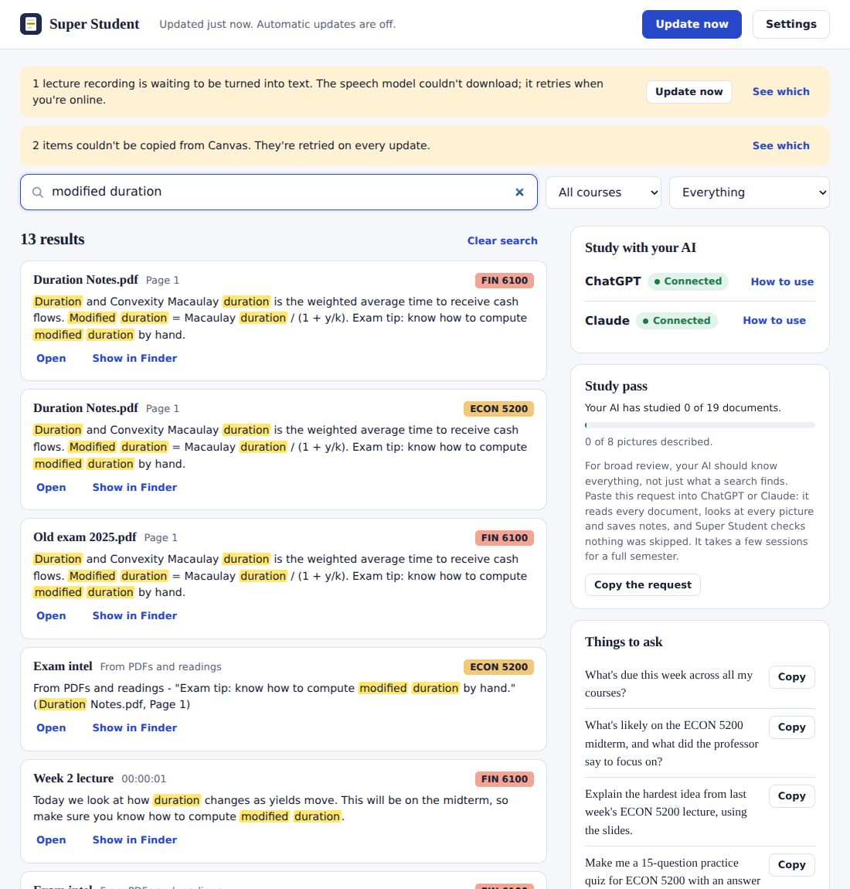
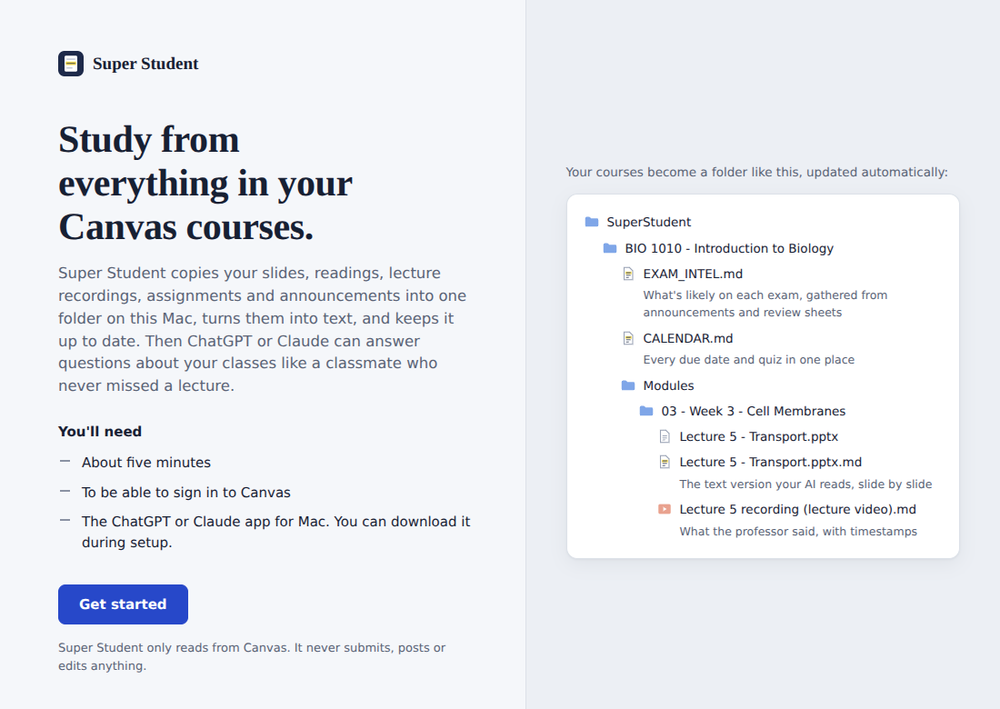
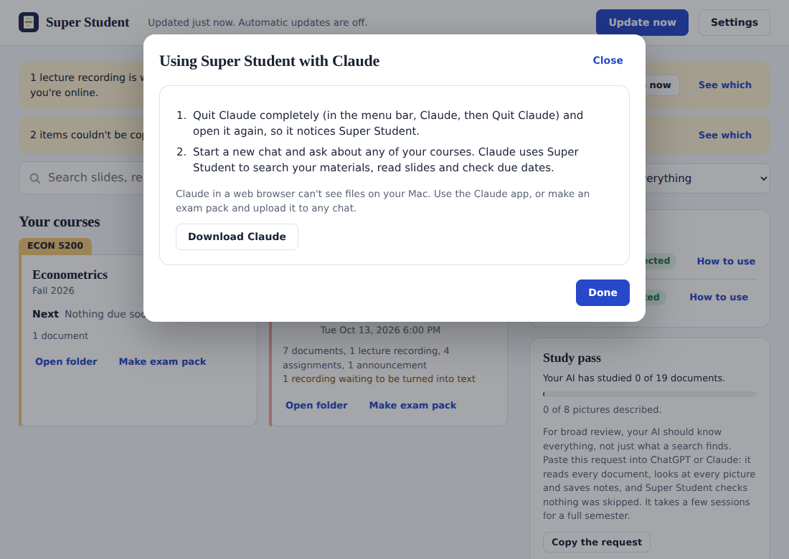

# Super Student

**Current scope: personal use only, while Canvas integration approval is unresolved.** Use your own account
and follow your institution's rules. Do not onboard other students through the personal-token setup.
An institution-approved OAuth developer key and approval for the integration are required before wider use;
neither has been established for this project. See [Canvas's OAuth requirements](https://developerdocs.instructure.com/services/canvas/oauth2/file.oauth)
and [Canvas's API policy](https://www.instructure.com/policies/canvas-api-policy), including its restrictions on
unapproved MCP integrations. This scope statement does not establish approval for personal MCP use.

**Version 1.7.0 adds saved exam practice and scheduled review, and includes the security and source-freshness fixes.** Replace the older app with this version
and reopen it to update its private runtime. Then restart ChatGPT and Claude so their connectors use the
updated code. Your course library and settings are kept. Older visual descriptions and study notes may
need to be recreated because source changes are now checked more strictly. Run **Update now** once after
upgrading to rebuild older extracted files before generating exam practice.

Turns your Canvas courses into a study library your AI can actually use, with **Claude** or **ChatGPT**
(Work, Chat and Codex). It pulls everything you can see in Canvas onto your Mac, keeps it up to date on
its own, converts it into searchable text with exact page, slide and timestamp markers, keeps the
originals so the AI can look at the real slide when a chart or formula matters, and connects it all to
the assistant you use. One library and one sync serve both.



**New here? The [Super Student website](https://marc-melone.github.io/super-student/) explains it in plain language.**

**Get the Mac app:** [download SuperStudent-1.7.0-mac.zip](https://github.com/Marc-Melone/super-student/releases/download/v1.7.0/SuperStudent-1.7.0-mac.zip)
(also in the [`releases`](releases) folder), then follow [Install the Mac app](#install-the-mac-app-no-terminal-needed). You need a Mac with macOS 13 or newer, the ChatGPT
or Claude desktop app, and a Canvas account that lets students make access tokens. It's a personal tool: one
student, their own courses, on their own Mac.

## How it works

1. **Copy.** You make a Canvas access token once; it's kept in your Mac's Keychain and only ever sent to your
   school's Canvas. Super Student copies everything you can see in each course. It only reads: it never submits,
   posts or edits anything.
2. **Convert.** Every file gets a text version next to the original, split at exact markers (`[Page 12]`,
   `[Slide 7]`, `[00:32:10]`) so answers can cite their source. Words inside pictures are read, lectures are
   transcribed on your Mac, and the AI can look at any slide or page as an image when a chart or formula matters.
3. **Organize.** Each course gets an overview, exam intel (everything said about exams, with sources), a calendar,
   grades and feedback, and an outline of every module, document, slide and page.
4. **Connect.** A built-in connector lets ChatGPT (desktop app and Codex) and Claude (desktop app and Claude Code)
   search, read and view your materials, and run a "study pass" so broad review covers everything, not just what
   a search happened to find.
5. **Stay current.** It updates in the background every few hours. Anything your instructor deletes or replaces
   moves to a dated `_Removed from Canvas` folder instead of being mixed in with current material.

### Exam preparation in 1.7.0

Choose **Prepare for exam** on a course card. Create a workspace with selected modules, optional date,
format, and scope your instructor specified. The source inventory is visible; module selections include
other course references such as syllabus and announcements. The selection remains unconfirmed exam scope.

Copy the preparation request into your connected ChatGPT or Claude. The assistant reads originals, checks
diagrams and equations, uses instructor notation and feedback, and saves practice through the connector.
Refresh the workspace to practice inside Super Student: multiple-choice questions are scored against the
saved AI answer key; written answers show a worked answer for your own assessment. Mistakes and due reviews
rise to the top, with saved attempts and a simple spaced review schedule. Changed, removed or restricted
sources disable affected practice until new questions are generated. Your library stays local.

Extracted text is tied to the exact original file used during conversion. Older extracted files need one
update to establish that link. A changed original or source ZIP blocks its previous text from supplying
new practice until conversion completes again.

Every question requires exact supporting quotations at unique source locators. This proves quotations exist
in current local source text, **not** that an AI answer is logically correct. Search can combine up to four
supplied alternate phrasings; it does not use embeddings or automatically search by meaning. The app still
uses your external assistant to create questions and explain new topics.

First-attempt quiz performance, self-assessment, and saved source-note coverage are separate. None is proof
of mastery or a prediction of an exam grade. No comparative answer-quality or learning study against
NotebookLM has been completed. Run the authored retrieval/evidence benchmark described in
[benchmarks/README.md](benchmarks/README.md) to reproduce the limited offline checks.

| Setup | Search across everything |
|---|---|
|  |  |
| **Welcome** | **Connecting Claude** |
|  |  |

## What it pulls

- **Files** in every format: slides (in presentation order, with speaker notes, charts as tables and slide
  images), PDFs (page by page, with charts, equations and scans flagged), Word, Excel (cell addresses and
  formulas kept), images, notebooks, code, zip files
- **Lecture videos**: Canvas captions when they exist, otherwise transcribed on your Mac with Whisper.
  While a video is being processed, a screenshot is saved whenever the screen changes and pinned to that
  moment in the transcript, so the AI can see the worked example the professor is talking about.
  YouTube links get YouTube's transcripts.
- **Whole slides**: when the AI looks at a slide it sees all of it as laid out, including the labels, arrows
  and text boxes placed over a picture, and the text version says which label points where.
- **Pictures**: diagrams, figures, photos and scanned pages are kept as images the AI can look at, and the
  words inside them (labels on an anatomy diagram, a scanned handout, a slide shown in a lecture video) are
  read into the text so searches find them. On a Mac this uses Apple's built-in text recognition, nothing to
  install; elsewhere it uses Tesseract if it's installed. See "Pictures and diagrams" below for the rest.
- **Pages, the syllabus** (equation-editor math is kept as LaTeX), **modules** in your instructor's order.
  That includes pages reachable only through a link and pages made with Canvas's newer block editor.
- **Assignments** with instructions, full rubrics, your score, rubric results and instructor comments, plus the
  files you submitted, the files your instructor sent back (marked-up papers) and recorded audio or video
  feedback (transcribed)
- **Quizzes**: the details, your score and, for quizzes you've taken whose results your instructor has
  released, the questions with your answers (and the correct answers when your instructor shows them)
- **Announcements, discussions** (instructor replies labeled, threads kept intact), **calendar** events
  (including discussion reply deadlines) and **grades**

Each course also gets generated study files:

| File | What's in it |
|---|---|
| `COURSE_OVERVIEW.md` | Instructor, current grade, what's coming up, exams, how the grade is weighted, module outline, what isn't in the library |
| `EXAM_INTEL.md` | Every sentence that mentions exams or that the professor emphasized ("this will be on the midterm", "make sure you know…") from announcements, the syllabus, slides and lecture transcripts, each with a link to its source |
| `CALENDAR.md` | Every deadline and event, upcoming and past |
| `GRADES.md` | Scores by category, where you lost points, all instructor feedback |
| `LINKS.md` | Outside links, and content Canvas doesn't hand over (publisher homework, Panopto, New Quizzes) |

Library layout:

```
~/SuperStudent/
  INDEX.md, AGENTS.md (ChatGPT/Codex), CLAUDE.md (Claude)
  Fall 2026/
    FIN 6100 - Fixed Income/
      COURSE_OVERVIEW.md  EXAM_INTEL.md  CALENDAR.md  GRADES.md  LINKS.md  Syllabus.md
      Modules/03 - Week 3 - Duration/     files, pages, lecture transcripts, _Module Contents.md
      Files/  Pages/  Assignments/  Quizzes/  Discussions/  Announcements/  Media/
      My Files/                           drop your own notes, textbook PDFs or recordings here
      _Study/                             study guides and practice exams the AI makes for you
      _Removed from Canvas/               anything your instructor deleted, replaced or hid, kept and dated
```

Every original `Lecture 5.pdf` sits next to its text version `Lecture 5.pdf.md`, and any images taken
from it go in `Lecture 5.pdf.assets/`.

When your instructor deletes, replaces or hides something, the next sync moves your copy to the course's
`_Removed from Canvas/` folder and marks it with the date, so it can't be mistaken for current material.
Search still finds it, after current material and labeled; exam intel and the study pass leave it out. If it
comes back on Canvas, it moves back.

If a newer file cannot be downloaded, the previous copy is kept with a source warning in the text, search
results and connector readings. Newly locked files receive a restricted-content warning even when Canvas
has not changed their timestamp or size. These copies are left out of exam intel and the study pass.
Successful retrieval clears the warning. Picture descriptions and study-note summaries are checked against
the current source content; older records without source hashes need to be reviewed and saved again.

## Install the Mac app (no Terminal needed)

1. Unzip `SuperStudent-<version>-mac.zip` and drag **Super Student** into Applications.
2. Open it. The app isn't from the App Store, so the first time macOS won't open it:
   - macOS 15 or newer: click **Done**, then System Settings → Privacy & Security → **Open Anyway** (next to
     the Super Student message) and confirm. Open the app again.
   - macOS 14 or older: Control-click the app → **Open** → **Open**.
3. Click **Set up**. It downloads a private copy of Python and everything it needs into `~/.superstudent`
   (about 300 MB, 3–10 minutes; nothing else on your Mac changes), then opens.
4. The setup window walks through it: your school's Canvas address (or search by school name), making a
   Canvas access token (with a button that opens the right Canvas page), picking courses, choosing
   ChatGPT, Claude or both, and options. It connects the AI apps, turns on automatic updates and starts the
   first copy, then shows exactly what to do in ChatGPT or Claude.

After that the app is a dashboard: each course with what's due next and what's been copied, search across
everything, one-click exam packs, **Update now**, and settings (courses, update frequency, lecture
transcription accuracy, reconnecting Canvas, reconnecting the AI apps, uninstall). Anything that needs
attention, like an expired token or recordings waiting to be transcribed, shows as a banner with a fix
button.

Newer versions of the app update the private copy the first time they're opened (an open Super Student
window from the older version is closed first). Afterwards the app reminds you to quit and reopen ChatGPT and
Claude so they use the new version. The command line tool is at `~/.superstudent/bin/superstudent` if you
want it.

The app uses ready-made downloads at pinned versions for Apple Silicon and Intel Macs on macOS 13 or newer,
so nothing has to be compiled on your Mac. Installation and upgrades were checked on Apple Silicon;
Intel execution and older macOS versions were not checked in this release. If your network needs a proxy set in
System Settings, setup uses it. If setup can't finish, it says why (no internet, not enough disk space, or the
app needs to be moved into Applications) and keeps a log under `~/.superstudent/logs/`.

### Build the app yourself

`python mac/build_app.py` creates `dist/Super Student.app` and `dist/SuperStudent-<version>-mac.zip` (it needs
the internet). The app contains a launcher script, Super Student as a wheel, the exact version of every
dependency for each kind of Mac (`constraints-arm64.txt`, `constraints-x86_64.txt`, all ready-made downloads for
macOS 13+), and pinned checksums for the installer (uv) it fetches from PyPI on first run. Nothing is written
inside the app, so it also works from a read-only location.

## Install with Terminal (macOS or Linux)

1. Unzip this folder anywhere.
2. In Terminal: `bash ~/Downloads/superstudent/install.sh` (adjust the path to where you unzipped it).
3. Setup asks for your Canvas address (e.g. `yourschool.instructure.com`) and an access token. To make the
   token: Canvas → Account → Settings → Approved Integrations → **+ New Access Token**. You paste it into
   Terminal (it's hidden as you paste) and it's stored in your macOS Keychain. Setup then turns on
   automatic syncing (every 6 hours), asks which AI you study with (Claude, ChatGPT, or both) and connects
   it, and runs the first sync.
4. Quit and reopen the Claude and/or ChatGPT desktop app.

`superstudent gui` opens the same app window (or `--browser` to use your web browser).

The first sync of a full semester can take a while, mostly for lecture transcription, which runs
in the background up to 2 hours per sync and continues on the next one.

## Using it

Just ask about your classes. The AI searches your materials, reads the right pages, views slides and
screenshots when something is visual, and cites where each answer came from.

- *"What's on the FIN 6100 midterm and what did Rivera say to focus on?"*
- *"Explain convexity the way it's taught in Week 3, with the formula from the slides."*
- *"Make a 20-question practice exam for modules 4–7 in the style of the quizzes, with an answer key."*
- *"Where did I lose points on problem sets, and what should I review?"*

### With ChatGPT

- **Work in a local project (best for studying).** In the ChatGPT desktop app, create a project, choose
  **Edit project → Add folder**, pick `~/SuperStudent` and make it the **primary** folder. Start Work tasks
  in that project. Work reads the library in place, picks up `AGENTS.md` and the `super-student` skill from
  the folder automatically, and uses the `superstudent` connector for fast search and page images (type
  `/mcp` in the message box to check it's connected). You can follow up from your phone while the Mac is on.
- **Codex (app or CLI)** uses the same connector, instructions and skill. Best if you want to change
  Super Student itself: `cd ~/SuperStudent && codex`.
- **ChatGPT on the web** can't reach files on your Mac. Start the task from the desktop app, or upload an
  exam pack (below).
- If you also have the older canvas-study plugin, turn it off so ChatGPT doesn't see two sets of Canvas tools.

### With Claude

- **Claude desktop app**: through the `superstudent` connector (added by setup).
- **Claude Code**: open a terminal in `~/SuperStudent` and run `claude`; it reads `CLAUDE.md` and the
  `super-student` skill automatically.

### Broad review and the study pass

Specific questions work from search. Broad review ("everything for the midterm") needs the whole course, so
Super Student gives the AI two more things:

- **`OUTLINE.md`** in each course: every module, document, slide and page in the instructor's order, with
  pictures marked. The AI scopes a review from it and checks nothing in scope was left out.
- **The study pass.** Paste the request from the app ("Source notes" panel, **Copy the request**) into ChatGPT
  or Claude. The AI works through the course in order: reads each document all the way through, looks at
  every slide and page with pictures, describes the pictures, and saves notes that cite every slide or page
  (`study_progress`, `save_study_notes`). Super Student checks the notes against the document and lists any
  missing slide or page references, flags documents that changed since, and tracks module and course notes.
  Reference coverage does not verify reading, understanding, or student learning.
  Notes go in `<course>/Study Notes/`, are searchable, and ride along in exam packs.

For broad questions the AI then reads the notes for everything in scope and opens the sources for detail,
instead of relying on whichever slides a search happened to find. `superstudent study` shows progress from
the command line.

### Token use

Accuracy comes first, so nothing the AI needs is cut. What's trimmed is repetition:

- The connector's tool descriptions (sent with every message) are short; the study steps arrive only when
  studying, and the skill's study section (`study-pass.md`) is read only then too.
- Documents are sent in a reading view: the same text, tables, labels, descriptions and locators, without
  repeated file plumbing (metadata the text already states, per-page reminders, image file paths).
- Search results list each document once, and text that appears in two files (the same handout posted
  twice) is shown once with both locations. Boilerplate never shows up as a hit.
- A document with the same content as one already studied isn't studied again.
- Several slides can be viewed in one call, and big photos are sent at the size the AI actually looks at.
- Broad review reads study notes first and opens the sources for detail.

Images are sent at full detail (about 1,500 px), never shrunk to save tokens.

### Pictures and diagrams

The AI can look at any picture, but it finds things by searching text, so a diagram with no words in it
can't be found until it's described. Paste this into ChatGPT or Claude once (the app has a copy button):

> Use Super Student to describe my course pictures: call list_undescribed_visuals, look at each one with
> view_page, and save what it shows with save_visual_description. Keep going in batches until they're all
> done, then tell me how many you described.

The AI looks at each diagram, figure, photo and scanned page and saves a short description (the view, every
labeled part, what it teaches). Descriptions go under the right page or slide in the text version, so
"posterior shoulder muscles" finds the slide even if its only words are in the picture. They're kept in
`~/SuperStudent/.superstudent/descriptions.json`, survive updates, and are set aside if the file changes.
The AI also describes pictures it looks at while you study. Command line: `superstudent visuals` lists
what's left; `superstudent describe "<path>" --at "Slide 12" --text "…"` saves one.

### Exam packs (any chat)

`superstudent pack --course "FIN 6100" --modules 4-7` bundles the original slides and PDFs (plus exam intel)
into `~/SuperStudent/_Exam Packs/` to drag into a Claude or ChatGPT chat or project, so the AI reads every
slide visually. Add `--pdf` to turn decks into PDFs (needs LibreOffice).

## Commands

| Command | Does |
|---|---|
| `superstudent sync` | Pull the latest now (`--course "FIN"` for one course) |
| `superstudent status` | Last sync, videos waiting for transcripts, anything that failed |
| `superstudent search "modified duration" --course FIN --kind slides` | Search everything (`--kind`: slides, lecture, reading, assignment, announcement, …) |
| `superstudent read "<path>" --at "Slide 12"` | Print a document or one page/slide/timestamp |
| `superstudent render "<path>" --page 12` | Save a page or slide as an image |
| `superstudent pack --course X --modules 4-7` | Exam pack of original files |
| `superstudent doctor` | Check what's installed, working and connected |
| `superstudent config [name] [value]` | Show or change settings |
| `superstudent schedule --every 3` / `unschedule` | Change or stop automatic syncing |
| `superstudent install-openai` | Connect (or reconnect) ChatGPT and Codex |
| `superstudent study` / `superstudent save-notes` | Study-pass progress / save notes from a file |
| `superstudent visuals` / `superstudent describe` | Pictures still needing a description / save one |
| `superstudent gui` | Open the app window (setup wizard the first time, then the dashboard) |
| `superstudent uninstall` | Remove automatic updates, AI connectors, the saved token and settings (keeps your courses) |
| `superstudent install-claude` | Connect (or reconnect) the Claude desktop app and Claude Code |
| `superstudent logout` | Remove the saved token |

## Optional extras

- **Exact slide images**: without LibreOffice, Super Student draws each slide itself (pictures, text boxes,
  labels, arrows, shapes and tables in their places; fonts and effects approximate), so the AI sees the slide as
  laid out. `brew install --cask libreoffice` makes them pixel-exact and adds older .ppt/.key and Word-to-PDF.
- **Reading text in pictures** is built in on a Mac (Apple's text recognition). On Linux or Windows,
  install Tesseract to get it.
- **Sharper transcripts**: `superstudent config whisper_model turbo` (slower, more accurate with jargon).
  On Apple Silicon, `SUPERSTUDENT_MLX=1 bash install.sh` adds a much faster transcriber.

## Settings

`~/.superstudent/config.json` (or `superstudent config`): `library_dir`, `courses` (`active` or a list of
course ids), `exclude_courses`, `transcribe` (`auto`/`off`), `whisper_backend`, `whisper_model`,
`media_minutes_per_sync`, `keep_media_files` (keep the videos after transcribing; off by default to save
space), `screen_snapshots`, `max_file_mb`, `max_media_mb`, `youtube_transcripts`, `download_my_submissions`,
`sync_interval_hours`.

## What it can't reach

Canvas doesn't give students these through its API, so they're listed in each course's `LINKS.md` instead:
publisher platforms (Pearson, McGraw Hill, Cengage), New Quizzes, Canvas Studio, Panopto, Zoom and other
outside video players, and anything locked or hidden. Past quiz questions come through only for quizzes
whose results your instructor has released. If something there matters, download or print it to PDF and
drop it in the course's `My Files/` folder; the next sync indexes it (recordings you download get
transcribed too).

## Privacy and safety

- Read-only: it only reads from Canvas. It never submits, posts, edits or deletes anything there. One side
  effect to know about: just like opening a page or file in your browser, reading it through Canvas can
  count as "viewed", so a module's "view this page" requirement may show as done.
- Your token stays in the macOS Keychain and is only sent to your school's Canvas address. Files are
  downloaded from Canvas with it; Canvas then hands each file over from its storage through a short-lived
  signed link, and the token is never sent there.
- It's a personal tool: it uses a personal access token, which Canvas provides for your own use with your
  own account. Use it for your own courses on your own Mac, and don't share the token or set it up with
  someone else's. Some schools turn student tokens off (see Troubleshooting).
- Everything stays on your Mac. The library folder is readable only by your account. Course content goes to
  the AI only when it reads it to answer you.
- If a token is ever exposed, delete it in Canvas (Account → Settings → Approved Integrations) and run
  `superstudent setup` with a new one.

## Troubleshooting

- **"Canvas rejected the token"**: it expired or was deleted. Make a new one and run `superstudent setup`.
- **No "+ New Access Token" button**: your school has turned student tokens off; this tool can't connect.
- **Scheduled syncs don't run**: keep the library in your home folder (the default). macOS blocks background
  access to Documents, Desktop, Downloads and iCloud Drive. Logs: `~/.superstudent/logs/`.
- **Videos stay "waiting for a transcript"**: run `superstudent doctor`; transcription needs faster-whisper.
- **ChatGPT doesn't see the connector**: run `superstudent install-openai`, fully quit and reopen ChatGPT,
  then type `/mcp`. You can also add it by hand: Settings → MCP servers → Add server → STDIO, using the
  command `install-openai` prints. The entry lives in `~/.codex/config.toml`.
- **Claude doesn't see the connector**: run `superstudent install-claude`, then fully quit and reopen Claude.
  Its connector log is `~/Library/Logs/Claude/mcp-server-superstudent.log`.

## Uninstall

In the app: **Settings → Uninstall**, then drag the app to the Trash. From Terminal: `superstudent uninstall`.
Either way it turns off automatic updates, removes the `superstudent` connector from ChatGPT/Codex and
Claude (leaving your other connectors alone), deletes the saved token, the skills and `~/.superstudent`.
Your `~/SuperStudent` course folder is kept unless you choose to move it to the Trash. Also delete the
access token in Canvas (Account → Settings → Approved Integrations).

## Tests

- `python tests/test_e2e.py` runs a full sync against a fake Canvas (pagination, rate limits, hidden tabs, a
  sign-in page disguised as a PDF, locked files, captions, discussions that require posting first) and checks
  every output, the search index, rendering, incremental re-sync and the connector.
- `python tests/test_openai.py` checks the ChatGPT/Codex setup: the config entry (read back by the real Codex
  CLI when it's installed), the skill and `AGENTS.md`, and a live search through Codex's app server.
- `python tests/test_visuals.py` checks reading labels in pictures (Tesseract, and Apple's recognition through
  a stand-in with the same calls), labels landing in PDF, slide and image text, and descriptions: saving,
  placement, search, the connector tools, surviving a re-sync, and being set aside when a file changes.
- `python tests/test_study.py` checks whole-slide drawing without LibreOffice, labels and arrows over
  pictures, the course outline, and the study pass: order, skipped-slide detection, module and course notes,
  changed documents, exam packs with slide PDFs and notes, the connector tools and commands.
- `python tests/test_review_fixes.py` checks the fixes from the final reviews: two-column PDFs and scans,
  equations in slides and Word files, small formula pictures, sideways photos, wide sheets, long names, hidden
  slides with LibreOffice, the token-first downloads (and that the token never reaches file storage), retries
  after a dropped connection, telling a revoked token from a locked item, saving the token without a command
  line, and syncing across changes: a page unlocking, a file replaced (moved to `_Removed from Canvas` with its
  notes and picture descriptions), a module renamed, past quiz questions, feedback files and recordings,
  linked-only and block-editor pages, threads with deleted posts, a classmate's exam rumor, and nothing
  rewritten when nothing changed. It also checks what the AI gets (searchable slide titles, locators that open
  the right section, paging, the outline by module, study-pass scope, exam packs with linked items, pictures in
  any format, links from transcripts, files outside the library refused) and the app (closing an old window on
  update, the restart reminder, installing transcription, stopping an update before uninstalling, schedule
  changes during an update, private config permissions, background-access warnings, runnable files revealed
  rather than opened).
- `python tests/test_gui.py` drives the app's local server through setup, a first update, search, exam
  packs, settings, an expired token, sign out and uninstall, and checks its security rules (session token,
  Host check, JSON-only requests, no opening files outside the library). `python tests/gui_demo.py` runs the
  app against the fake Canvas so you can click through it (demo token: `test-token-123-padding-to-look-real`).
- `python tests/test_high_priority.py` checks exact-origin credentials, external symlinks across library tools,
  safe download staging, stale/restricted sources, interrupted syncs, content hashes and derived-note freshness.
  It uses temporary libraries, dummy credentials and local test servers; it never contacts a real Canvas account.
- `python tests/test_exam_retrieval.py` checks alternate-query search, exact course boundaries, source quotations,
  unique locators, fingerprints, and evidence-cache invalidation.
- `python tests/test_exams.py` checks exam scope, hidden answers, scoring, self-assessment, scheduled review,
  stale sources, and safe local storage.
- `python tests/test_exam_workflow.py` checks the exam workflow through the real local HTTP and MCP interfaces.
- `python tests/test_extraction_evidence.py` checks conversion provenance, unchanged-timestamp edits, ZIP
  member refresh and recording refresh using temporary files and mocked downloads/transcription.
- `python benchmarks/exam_retrieval.py --require-improvement` runs the authored offline retrieval/evidence
  benchmark. Its limits are described in [benchmarks/README.md](benchmarks/README.md).

Set `SUPERSTUDENT_NO_SOFFICE=1` to skip optional LibreOffice launches when testing in an environment where
LibreOffice is unavailable or unstable. The built-in slide renderer is still exercised.
